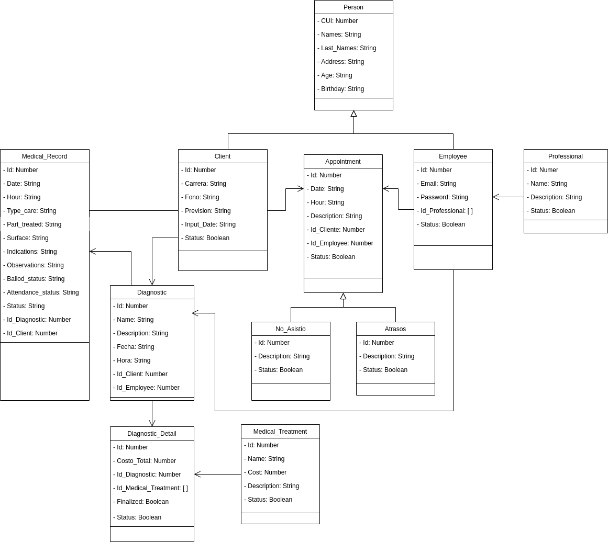
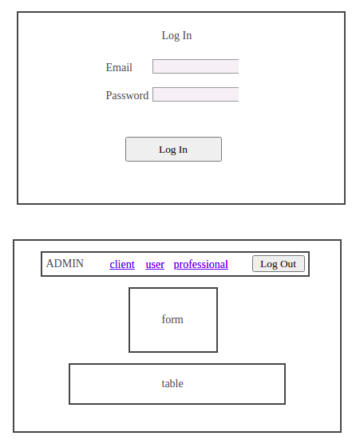
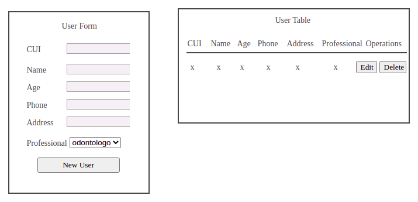

# Titulo: Smile Dental Clinic

## Overview: 
Plataforma web para gestionar las citas de una clinica de odontologia de los diferentes clientes,asi como tambien se podra administrar a los especialistas y personal en general que estaran laborando en la clinica.

### Alcance(Scope)

- La aplicacion tendra acceso para un usuario administrador, para poder gestinar a los empleados y usuarios de la clinica.
- La aplicacion tendra acceso para usuarios empleados(especialistas,secretarias y asistentes), para poder gestionar las diferentes operaciones segun su especialidad y actividad asignado.

#### Casos de uso

* El usuario administrador puede crear nuevos usuarios especialistas.
* El usuario administrador puede crear nuevos usuarios secretarias.
* El usuario administrador puede crear nuevos usuarios asistentes.
* El usuario secretaria puede crear citas .
* El usuario especialista puede crear diagnosticos medicos para un paciente .
* El usuario asistente puede crear operaciones segun con el especialista o secretaria asignado.


#### Out of Scope (casos de uso No Soportados)

* El usuario no puede acceder con cuentas de tercero(google,facebook etc.)
* El usuario no puede registrarse sin una contaseña valida.
* El usuario admministrador no puede crear citas.
* El usuario usuario empleado no puede crear a un especialista.

---
## Arquitectura

### Diagramas
Diagrama de clases



### Modelo de datos
JSON de algunas entidades

```
Client [ 
    { 
        "id": 1,
        "cui": 123456789,
        "names": "luis carlos",
        "last_names": "ruiz diaz",
        "phone_number": 12345678,
        "address": "ciudad de guatemala",
        "age": 34,
        "birthday": "2022-06-16",
        "carrera": "cotador",
        "fono": "ninguno",
        "prevision": "ninguno",
        "input_date": "2022-08-12",
        "status": true
    }
]
```
```
Professional[
    {
        "id": 1,
        "name": "Odontologo",
        "description": "Es un especialista encargado del area bucal",
        "status": true
    }
]
```

```
Diagnostic[
    {
        "id": 1,
        "name": "Diagnostico 1",
        "description": "Para un cliente frecuente",
        "date": "2022-08-15",
        "hour": "10:30:00",
        "total_cost": 0,
        "status": true,
        "client": {
            "names": "nicolas estuardo",
            "phone_number": 90781232
        },
        "employee": {
            "names": "paula",
            "age": 30,
            "professional": "Odontologo"
        }
    }
]
```

---
## Prototipo
Inicio de sesion y Administrador


Formulario y Tabla de datos


